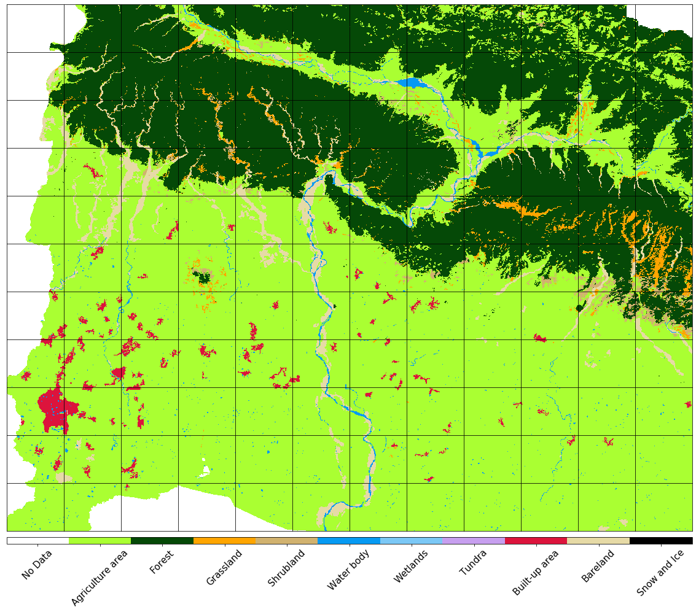
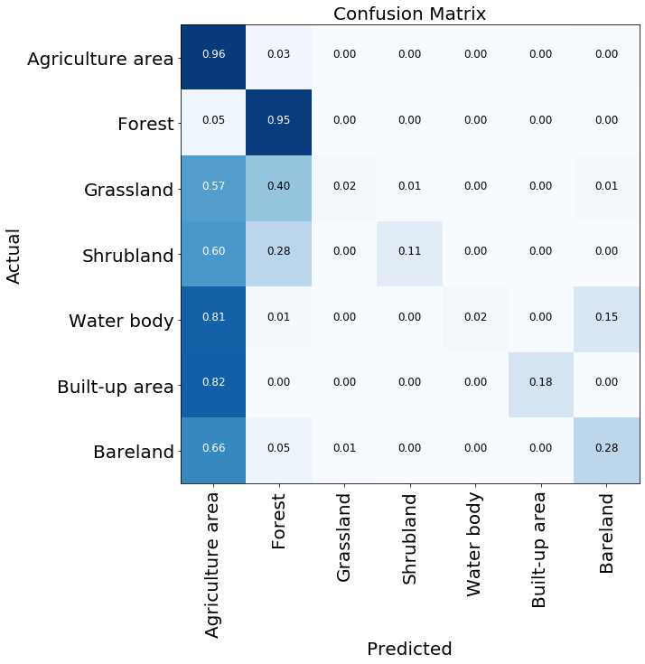

```{r setup, include=FALSE}
knitr::opts_chunk$set(
  results = 'asis',
  echo = FALSE,
  warning = FALSE,
  message = FALSE,
  fig.align = 'center'
)

#Load libraries
#library(tidyverse)
#library(gapminder)
#library(gganimate)
#library(kableExtra)
```


# Introduction
I am a Water Resouce Modeler from Land and Water and interested in programming. I learnt basic Matlab at Uni and now would like to switch to Python. 


# My Synthesis Project
To identify crop arears in the Kamala Catchment, Nepal, using **Machine Learning (ML)** in remote sensing satellite data.


# My Digital Toolbox
* Python - `Matplotlib`, `Numpy`, `Geopands`(Basics of GIS), `EO - Learn` (Earth observation and remote sensing), `Sklearn` and `LightGBM` (ML).

# My time went ...

- I spent the most of my time in data preparation and manipulation. 
- The most challenges were to clean and reshape
  
      **5D dataset (pixel, time, x and y coordinates, features)** into 
      
      **2D (pixel * (x,y), time * features)**
      
- 8 features for eace pixel
        
      **Spectral Channels (B02, B03, B04, B08, B11, B12)** &
      
      **2 calculated indices (Normalized Difference *Vegetation* and *Water* Index)**


# Data Processing
Data from Satellite Sentinel - 2, with spatial resoultion of *10* m and temporal resoultion of *16* days. 
<br/>

- Index calculation

- Remove cloud effects

- Spatial interpolation

- Temporal interpolation

**Natural Look and normalised indices**

{width=900px}
<br/>
<br/>
**Reference of Land Cover Map for Supervised Classification ML**
{width=800px}

# Preliminary Resutls
- Data Training to create a model
- Model Validation: 
**performance measurement for machine learning classification**
{width=800px}

# Further Improvements
- There is unbalanced training set among different classes.
- The reference map is not up-to-date.
{width=500px}

# My Data School Experience
 - Wonderful experience to learn multiple tools: python, R and SQL
 - Already have applied to my daily work. i.e. write a python script to transfer a batch of PPTs to PDFs and Word documents
 - Inspired me to learn more after dataschool